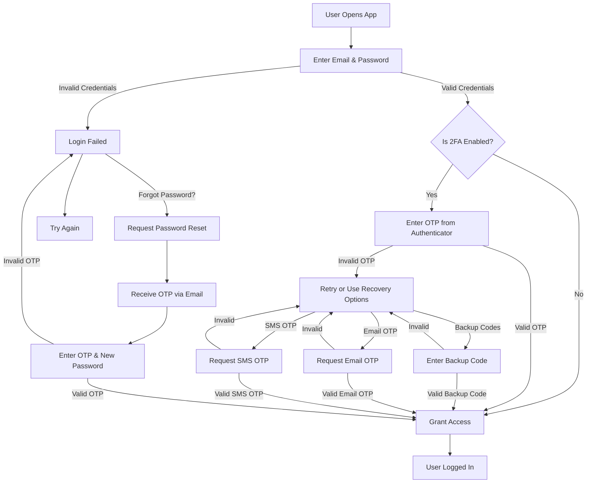

# Authentication & Authorization API

This repository contains a **secure authentication system** with support for **JWT, refresh tokens, Two-Factor Authentication (2FA), social logins (Google/Facebook), and password recovery**.

## 📌 Features

- User **Signup & Login**
- **JWT & Refresh Token** Authentication
- **Role-based Access Control (RBAC)**
- **Two-Factor Authentication (2FA)** (via OTP & Backup Codes)
- **Social Login (Google & Facebook)**
- **Forgot & Reset Password**
- **Rate-limiting to prevent brute-force attacks**
- **2FA Recovery via Email & SMS**

## 🚀 Installation & Setup

### 1️⃣ Clone the Repository

```sh
git clone https://github.com/your-username/auth-api.git
cd auth-api
```

### 2️⃣ Install Dependencies

```sh
npm install
```

### 3️⃣ Setup Environment Variables

Create a `.env` file and configure it:

```env
PORT=
NODE_ENV=
BASE_URL=
DATABASE=
DATABASE_DOCKER=
DATABASE_USERNAME=
DATABASE_PASSWORD=
APP_NAME=


REDIS_HOST=
REDIS_PORT=
REDIS_PASSWORD=

JWT_SECRET=
JWT_EXPIRES_IN=
JWT_COOKIE_EXPIRES_IN=
JWT_REFRESH_EXPIRES_IN=

GOOGLE_CLIENT_ID=
GOOGLE_CLIENT_SECRET=
GOOGLE_CALLBACK_URL=

FACEBOOK_APP_ID=
FACEBOOK_APP_SECRET=
FACEBOOK_CALLBACK_URL=

SESSION_SECRET=

EMAIL_HOST=
EMAIL_PORT=

EMAIL_FROM=
EMAIL_USER=
EMAIL_PASSWORD=

TWILIO_SID=
TWILIO_AUTH_TOKEN=
TWILIO_PHONE_NUMBER=
```

### 4️⃣ Start the Server

```sh
npm start
```

## 🛠️ API Endpoints

### 🔑 Authentication

| Endpoint                     | Method   | Description                   |
| ---------------------------- | -------- | ----------------------------- |
| `/api/v1/auth/signup`        | **POST** | Register a new user           |
| `/api/v1/auth/login`         | **POST** | Authenticate and receive JWT  |
| `/api/v1/auth/logout`        | **POST** | Logout user and clear session |
| `/api/v1/auth/refresh-token` | **POST** | Refresh access token          |
| `/api/v1/auth/google`        | **POST** | Register & Login use Google   |
| `/api/v1/auth/facebook`      | **POST** | Register & Login use Facebook |

### 🔐 Two-Factor Authentication (2FA)

| Endpoint                                | Method     | Description                        |
| --------------------------------------- | ---------- | ---------------------------------- |
| `/api/v1/auth/2fa/setup`                | **POST**   | Setup 2FA (Generate QR Code)       |
| `/api/v1/auth/2fa/verify`               | **POST**   | Verify 2FA OTP                     |
| `/api/v1/auth/2fa/reset`                | **DELETE** | Disable 2FA                        |
| `/api/v1/auth/backup-codes`             | **POST**   | Generate backup codes              |
| `/api/v1/auth/backup-codes/verify`      | **POST**   | Verify backup code                 |
| `/api/v1/auth/2fa/recovery-code`        | **POST**   | Request 2FA recovery OTP via email |
| `/api/v1/auth/2fa/recovery-code/verify` | **POST**   | Verify 2FA recovery OTP            |
| `/api/v1/auth/2fa/recovery/request-sms` | **POST**   | Request 2FA recovery OTP via SMS   |
| `/api/v1/auth/2fa/recovery/verify-sms`  | **POST**   | Verify 2FA recovery OTP via SMS    |

### 🔄 Password Recovery

| Endpoint                         | Method   | Description                |
| -------------------------------- | -------- | -------------------------- |
| `/api/v1/auth/forgot-password`   | **POST** | Request password reset OTP |
| `/api/v1/auth/verify-reset-code` | **POST** | Verify reset OTP           |
| `/api/v1/auth/reset-password`    | **POST** | Reset password             |

## 🔍 Authentication & 2FA Flowchart

The following diagram illustrates the **user authentication process**, including **2FA verification and recovery options**:



## 🛡️ Security Features

- **JWT Authentication & Refresh Token Handling**
- **Brute-force protection via rate limiting**
- **Two-Factor Authentication (OTP & Backup Codes)**
- **Secure password hashing with bcrypt**

## 📝 License

This project is licensed under the **MIT License**.
