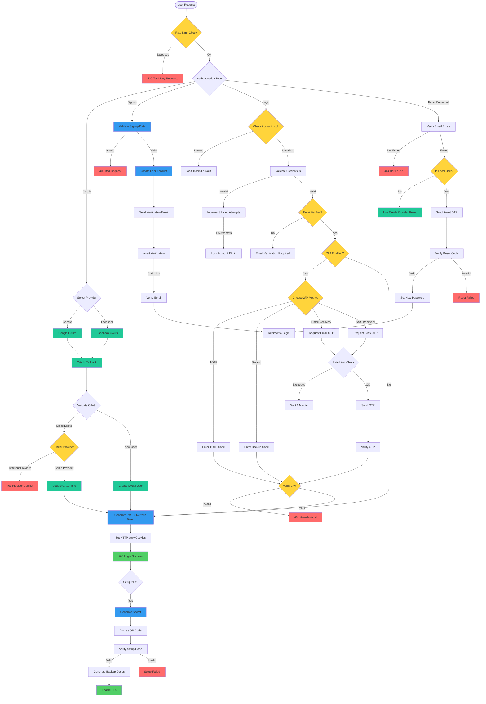

# Authentication & Authorization API

This repository contains a **secure authentication system** with support for **JWT, refresh tokens, Two-Factor Authentication (2FA), social logins (Google/Facebook), and password recovery**.

## 📌 Features

### 🔐 Core Authentication

- **Local Authentication**

  - Email/Password registration and login
  - Email verification
  - Password strength validation
  - Secure password reset flow

- **OAuth Integration**
  - Google OAuth2.0
  - Facebook OAuth
  - Provider conflict resolution
  - Automatic account linking

### 🛡️ Two-Factor Authentication (2FA)

- **TOTP-Based Authentication**

  - QR code setup
  - Time-based OTP verification
  - Compatible with Google Authenticator/Authy

- **Recovery Options**
  - Backup codes generation and management
  - Email-based recovery
  - SMS-based recovery (via Twilio)
  - Rate-limited recovery attempts

### 🔒 Security Features

- **Brute Force Protection**

  - Account lockout after 5 failed attempts
  - 15-minute lockout period
  - Failed attempt tracking

- **Rate Limiting**

  - API-wide rate limiting
  - Stricter limits for authentication endpoints
  - Per-user and per-IP rate limiting

- **Token Management**
  - JWT-based authentication
  - Refresh token rotation
  - Secure HTTP-only cookies

### 📧 Communication

- **Email Services**

  - Verification emails
  - Password reset notifications
  - 2FA recovery codes

- **SMS Integration**
  - 2FA verification codes
  - Recovery codes

## 🛠️ Technical Stack

- **Backend Framework**: Node.js + Express
- **Database**: MongoDB + Mongoose
- **Authentication**: Passport.js, JWT
- **Email Service**: Nodemailer
- **SMS Service**: Twilio
- **Security Packages**:
  - `express-rate-limit`
  - `helmet`
  - `express-mongo-sanitize`
  - `xss-clean`
  - `speakeasy` (for TOTP)
  - `qrcode` (for 2FA setup)

## 🚀 Installation & Setup

### 1️⃣ Clone the Repository

```sh
git clone https://github.com/your-username/auth-api.git
cd auth-api
```

### 2️⃣ Install Dependencies

```sh
npm install
```

### 3️⃣ Setup Environment Variables

Create a `.env` file and configure it:

```env
PORT=
NODE_ENV=
BASE_URL=
DATABASE=
DATABASE_DOCKER=
DATABASE_USERNAME=
DATABASE_PASSWORD=
APP_NAME=


REDIS_HOST=
REDIS_PORT=
REDIS_PASSWORD=

JWT_SECRET=
JWT_EXPIRES_IN=
JWT_COOKIE_EXPIRES_IN=
JWT_REFRESH_EXPIRES_IN=

GOOGLE_CLIENT_ID=
GOOGLE_CLIENT_SECRET=
GOOGLE_CALLBACK_URL=

FACEBOOK_APP_ID=
FACEBOOK_APP_SECRET=
FACEBOOK_CALLBACK_URL=

SESSION_SECRET=

EMAIL_HOST=
EMAIL_PORT=

EMAIL_FROM=
EMAIL_USER=
EMAIL_PASSWORD=

TWILIO_SID=
TWILIO_AUTH_TOKEN=
TWILIO_PHONE_NUMBER=
```

### 4️⃣ Start the Server

```sh
npm start
```

## 🛠️ API Endpoints

### 🔑 Authentication

| Endpoint                                 | Method   | Description                   |
| ---------------------------------------- | -------- | ----------------------------- |
| `/api/v1/auth/signup`                    | **POST** | Register a new user           |
| `/api/v1/auth/login`                     | **POST** | Authenticate and receive JWT  |
| `/api/v1/auth/logout`                    | **POST** | Logout user and clear session |
| `/api/v1/auth/refresh-token`             | **POST** | Refresh access token          |
| `/api/v1/auth/google`                    | **POST** | Register & Login use Google   |
| `/api/v1/auth/facebook`                  | **POST** | Register & Login use Facebook |
| `/api/v1/auth/verify-email`              | **GET**  | Verify user email             |
| `/api/v1/auth/resend-verification-email` | **POST** | Resend verification email     |

### 🔐 Two-Factor Authentication (2FA)

| Endpoint                                | Method     | Description                        |
| --------------------------------------- | ---------- | ---------------------------------- |
| `/api/v1/auth/2fa/setup`                | **POST**   | Setup 2FA (Generate QR Code)       |
| `/api/v1/auth/2fa/verify`               | **POST**   | Verify 2FA OTP                     |
| `/api/v1/auth/2fa/reset`                | **DELETE** | Disable 2FA                        |
| `/api/v1/auth/backup-codes`             | **POST**   | Generate backup codes              |
| `/api/v1/auth/backup-codes/verify`      | **POST**   | Verify backup code                 |
| `/api/v1/auth/2fa/recovery-code`        | **POST**   | Request 2FA recovery OTP via email |
| `/api/v1/auth/2fa/recovery-code/verify` | **POST**   | Verify 2FA recovery OTP            |
| `/api/v1/auth/2fa/recovery/request-sms` | **POST**   | Request 2FA recovery OTP via SMS   |
| `/api/v1/auth/2fa/recovery/verify-sms`  | **POST**   | Verify 2FA recovery OTP via SMS    |

### 🔄 Password Recovery

| Endpoint                         | Method   | Description                |
| -------------------------------- | -------- | -------------------------- |
| `/api/v1/auth/forgot-password`   | **POST** | Request password reset OTP |
| `/api/v1/auth/verify-reset-code` | **POST** | Verify reset OTP           |
| `/api/v1/auth/reset-password`    | **POST** | Reset password             |

## 🔍 Authentication & 2FA Flowchart

The following diagram illustrates the **user authentication process**, including **2FA verification and recovery options**:



## 📝 License

This project is licensed under the **MIT License**.
